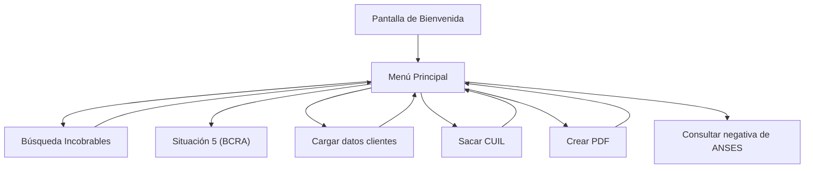
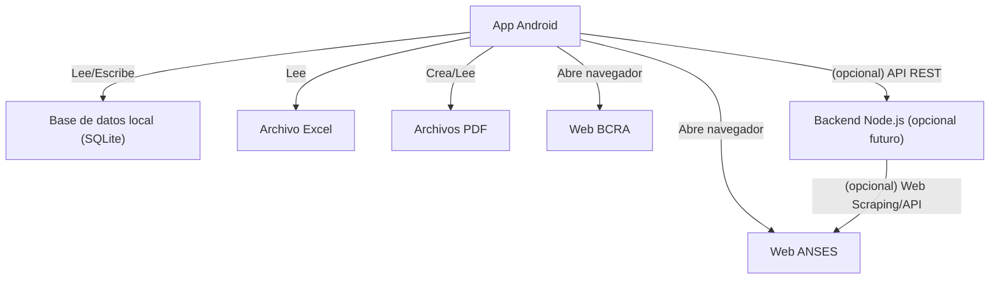
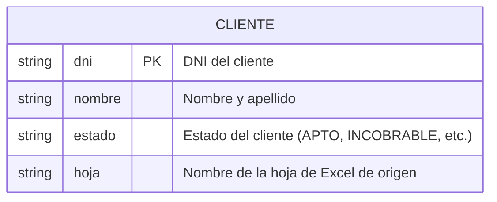

# Alfa Ediciones

Aplicación Android para la gestión de clientes, búsqueda de incobrables, consulta de CUIL, generación de PDF y accesos rápidos a servicios externos como ANSES y BCRA.

---

## Índice
- [Resumen del Proyecto](#resumen-del-proyecto)
- [Pasos de Uso](#pasos-de-uso)
- [Diagrama de Pantallas y Navegación](#diagrama-de-pantallas-y-navegación)
- [Red de Interconexiones](#red-de-interconexiones)
- [Diagrama de Interconexiones](#diagrama-de-interconexiones)
- [Base de Datos](#base-de-datos)
- [Diagrama de Base de Datos](#diagrama-de-base-de-datos)

---

## Resumen del Proyecto

**Nombre:** Alfa Ediciones  
**Descripción:** Aplicación Android para gestión de clientes, búsqueda de incobrables, consulta de CUIL, generación de PDF y acceso rápido a servicios externos como ANSES y BCRA.

---

## Pasos de Uso

1. **Pantalla de Bienvenida:**
   - Muestra el nombre de la app y un botón "Ingresar".
2. **Menú Principal:**
   - Búsqueda Incobrables: Permite buscar el estado de un cliente por DNI.
   - Situación 5: Acceso directo a la web del BCRA.
   - Cargar datos clientes: Permite cargar datos de clientes manualmente.
   - Sacar CUIL: Calcula el CUIL a partir del DNI y género.
   - Crear PDF: Genera un PDF de ejemplo.
   - Consultar negativa de ANSES: Acceso directo a la web de ANSES para obtener la negativa.
3. **Flujo de búsqueda:**
   - El usuario ingresa un DNI y la app busca en la base de datos local (SQLite) si el cliente es incobrable.
   - Si no está, muestra que el DNI es apto.
4. **Carga de datos:**
   - Permite ingresar manualmente datos de clientes y guardarlos en la base local.
5. **Consulta de CUIL:**
   - El usuario ingresa el DNI y selecciona el género, la app calcula el CUIL.
6. **Generación de PDF:**
   - Crea un PDF de ejemplo y lo guarda en la carpeta de la app.
7. **Accesos directos web:**
   - Los botones de ANSES y BCRA abren el navegador en la página correspondiente.

---

## Diagrama de Pantallas y Navegación

---

## Red de Interconexiones

- **App Android**
  - **Base de datos local (SQLite):** Para almacenar y consultar clientes.
  - **Archivos locales:** Para guardar y leer archivos Excel y PDF.
  - **Internet:**
    - Acceso a la web de ANSES (para negativa)
    - Acceso a la web del BCRA (situación crediticia)
- **(Opcional futuro)**
  - **Backend propio:** Si decides agregar scraping o integración con servicios externos, la app se conectaría a un backend Node.js.

---

## Diagrama de Interconexiones

---

## Base de Datos

La app utiliza una base de datos local SQLite para almacenar información de clientes. Los datos pueden ser cargados desde un archivo Excel o ingresados manualmente.

### Tabla principal: `Cliente`
- **dni**: DNI del cliente (clave primaria)
- **nombre**: Nombre y apellido
- **estado**: Estado del cliente (APTO, INCOBRABLE, etc.)
- **hoja**: Nombre de la hoja de Excel de origen

---

## Diagrama de Base de Datos

