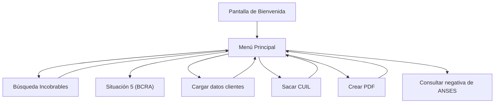
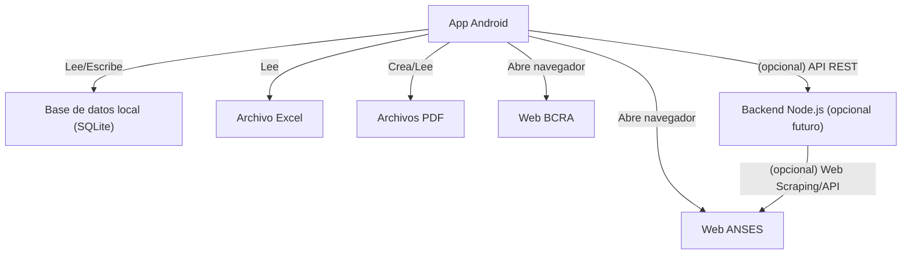
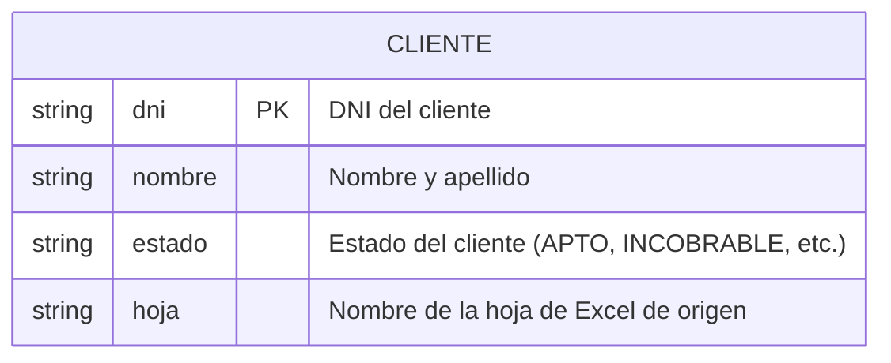
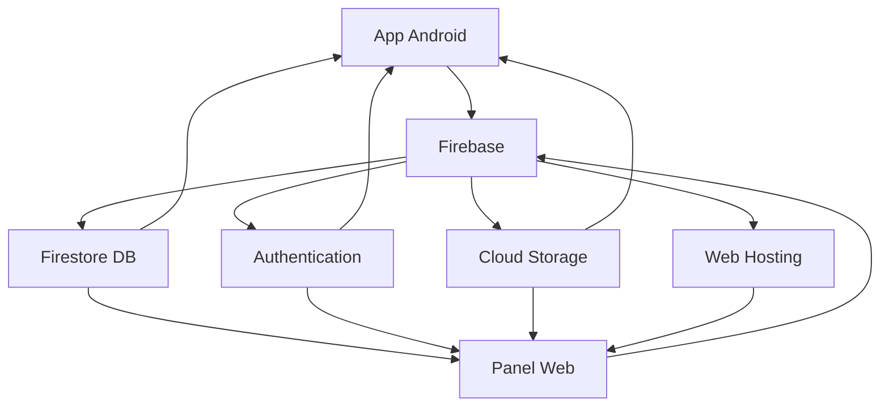

# Alfa Ediciones

Aplicación Android para la gestión de clientes, búsqueda de incobrables, consulta de CUIL, generación de PDF y accesos rápidos a servicios externos como ANSES y BCRA.

---

## Índice
- [Resumen del Proyecto](#resumen-del-proyecto)
- [Pasos de Uso](#pasos-de-uso)
- [Diagrama de Pantallas y Navegación](#diagrama-de-pantallas-y-navegación)
- [Red de Interconexiones](#red-de-interconexiones)
- [Diagrama de Interconexiones](#diagrama-de-interconexiones)
- [Base de Datos](#base-de-datos)
- [Diagrama de Base de Datos](#diagrama-de-base-de-datos)
- [Infraestructura en la Nube](#infraestructura-en-la-nube)
- [Plan de Implementación Empresarial](#plan-de-implementación-empresarial)
- [Costos y Escalabilidad](#costos-y-escalabilidad)

---

## Resumen del Proyecto

**Nombre:** Alfa Ediciones  
**Descripción:** Aplicación Android para gestión de clientes, búsqueda de incobrables, consulta de CUIL, generación de PDF y acceso rápido a servicios externos como ANSES y BCRA.

---

## Pasos de Uso

1. **Pantalla de Bienvenida:**
   - Muestra el nombre de la app y un botón "Ingresar".
2. **Menú Principal:**
   - Búsqueda Incobrables: Permite buscar el estado de un cliente por DNI.
   - Situación 5: Acceso directo a la web del BCRA.
   - Cargar datos clientes: Permite cargar datos de clientes manualmente.
   - Sacar CUIL: Calcula el CUIL a partir del DNI y género.
   - Crear PDF: Genera un PDF de ejemplo.
   - Consultar negativa de ANSES: Acceso directo a la web de ANSES para obtener la negativa.
3. **Flujo de búsqueda:**
   - El usuario ingresa un DNI y la app busca en la base de datos local (SQLite) si el cliente es incobrable.
   - Si no está, muestra que el DNI es apto.
4. **Carga de datos:**
   - Permite ingresar manualmente datos de clientes y guardarlos en la base local.
5. **Consulta de CUIL:**
   - El usuario ingresa el DNI y selecciona el género, la app calcula el CUIL.
6. **Generación de PDF:**
   - Crea un PDF de ejemplo y lo guarda en la carpeta de la app.
7. **Accesos directos web:**
   - Los botones de ANSES y BCRA abren el navegador en la página correspondiente.

---

## Diagrama de Pantallas y Navegación



---

## Red de Interconexiones

- **App Android**
  - **Base de datos local (SQLite):** Para almacenar y consultar clientes.
  - **Archivos locales:** Para guardar y leer archivos Excel y PDF.
  - **Internet:**
    - Acceso a la web de ANSES (para negativa)
    - Acceso a la web del BCRA (situación crediticia)
- **(Opcional futuro)**
  - **Backend propio:** Si decides agregar scraping o integración con servicios externos, la app se conectaría a un backend Node.js.

---

## Diagrama de Interconexiones



---

## Base de Datos

La app utiliza una base de datos local SQLite para almacenar información de clientes. Los datos pueden ser cargados desde un archivo Excel o ingresados manualmente.

### Tabla principal: `Cliente`
- **dni**: DNI del cliente (clave primaria)
- **nombre**: Nombre y apellido
- **estado**: Estado del cliente (APTO, INCOBRABLE, etc.)
- **hoja**: Nombre de la hoja de Excel de origen

---

## Diagrama de Base de Datos



---

## Infraestructura en la Nube

### **¿Por qué necesitas infraestructura en la nube?**

Para una aplicación empresarial con múltiples usuarios y alto volumen de datos, necesitas:

1. **Sincronización entre usuarios:** Todos los empleados ven los mismos datos en tiempo real
2. **Acceso desde computadora:** Panel web para ver datos desde PC
3. **Respaldo automático:** Los datos están seguros en la nube
4. **Escalabilidad:** La app crece con tu empresa
5. **Seguridad empresarial:** Autenticación y encriptación profesional

### **Solución recomendada: Firebase**

Firebase es la mejor opción para tu proyecto porque:

- ✅ **Integración nativa con Android**
- ✅ **Base de datos en tiempo real**
- ✅ **Autenticación de usuarios**
- ✅ **Almacenamiento de archivos**
- ✅ **Notificaciones push**
- ✅ **Panel web incluido**
- ✅ **Escalable automáticamente**

### **Servicios de Firebase que usarás:**

#### **Firestore (Base de datos en tiempo real):**
- Sincronización automática entre todos los usuarios
- Datos accesibles desde app y web
- Backup automático

#### **Authentication:**
- Sistema de login para empleados
- Control de acceso por roles
- Seguridad empresarial

#### **Storage:**
- Almacenamiento de archivos (PDFs, imágenes)
- Organización automática
- Acceso seguro

#### **Hosting:**
- Panel web para ver datos desde PC
- Dashboard con estadísticas
- Reportes en tiempo real

---

## Plan de Implementación Empresarial

### **FASE 1: Configuración de Firebase (1 semana)**
1. Crear proyecto en Firebase Console
2. Configurar autenticación de usuarios
3. Crear base de datos Firestore
4. Configurar reglas de seguridad

### **FASE 2: Modificar App Android (2 semanas)**
1. Integrar Firebase SDK
2. Implementar autenticación
3. Conectar con Firestore
4. Agregar sincronización de datos
5. Implementar manejo offline

### **FASE 3: Crear Panel Web (2 semanas)**
1. Desarrollar interfaz web con React
2. Implementar autenticación
3. Crear dashboard de datos
4. Agregar filtros y búsquedas
5. Implementar reportes

### **FASE 4: Testing y Despliegue (1 semana)**
1. Pruebas con múltiples usuarios
2. Optimización de rendimiento
3. Configurar monitoreo
4. Despliegue a producción

### **FASE 5: Capacitación y Mantenimiento**
1. Capacitar empleados
2. Documentar procesos
3. Monitoreo continuo
4. Actualizaciones regulares

---

## Costos y Escalabilidad

### **Costos estimados mensuales:**

#### **Plan Gratuito (hasta 50,000 lecturas/día):**
- ✅ Firebase Firestore: Gratis
- ✅ Firebase Authentication: Gratis
- ✅ Firebase Storage: 5GB gratis
- ✅ Firebase Hosting: Gratis
- **Total:** $0 USD/mes

#### **Plan Pago (uso empresarial):**
- 🔥 Firebase Firestore: $25 USD/mes
- 🔥 Firebase Authentication: $5 USD/mes
- 🔥 Firebase Storage: $10 USD/mes
- 🔥 Firebase Hosting: $5 USD/mes
- **Total:** ~$45 USD/mes

### **Escalabilidad:**
- **Hasta 1,000 usuarios:** Plan gratuito
- **1,000-10,000 usuarios:** Plan pago básico
- **Más de 10,000 usuarios:** Plan pago avanzado

### **Ventajas de Firebase:**
- **Pago por uso:** Solo pagas lo que usas
- **Escalado automático:** Se adapta al crecimiento
- **Sin configuración de servidores:** Todo es automático
- **99.9% uptime:** Confiabilidad empresarial

---

## Arquitectura Final con Firebase



---

## Próximos Pasos

1. **Configurar Firebase** en el proyecto
2. **Implementar autenticación** de usuarios
3. **Migrar datos** de SQLite a Firestore
4. **Crear panel web** para administración
5. **Desplegar** a producción

---

## Uso en navegador (versión web mínima)

Se agregó una versión web simple en `web/` para usar las funciones principales en cualquier navegador:

- **Búsqueda de incobrables** contra Firestore (`colección clientes`)
- **Calculadora de CUIL** (misma lógica que la app)
- **Enlaces rápidos** a BCRA y ANSES

### 1) Configurar Firebase Web

1. En Firebase Console, crea una **app Web** y copia la configuración.
2. Abre `web/app.js` y reemplaza el objeto `firebaseConfig` con tus valores.
3. En Firestore, crea la colección `clientes` con documentos que tengan los campos: `dni` (string), `nombre` (string), `estado` (string), `hoja` (string).

Reglas mínimas (ajusta a tus necesidades):

```js
rules_version = '2';
service cloud.firestore {
  match /databases/{database}/documents {
    match /{document=**} {
      allow read, write: if request.time < timestamp.date(2099, 1, 1);
    }
  }
}
```

### 2) Probar en local

Con Node.js instalado, sirve la carpeta `web/` con un servidor estático:

```bash
cd web
npx --yes serve -l 5173
```

Abre `http://localhost:5173` y prueba búsqueda y cálculo de CUIL.

Si no tienes Node, puedes abrir `web/index.html` en el navegador, pero se recomienda servidor local.

### 3) Desplegar en Firebase Hosting (opcional)

```bash
npm i -g firebase-tools
firebase login
firebase init hosting   # selecciona el proyecto, usa "web" como carpeta pública, single-page: No
firebase deploy
```

### 4) Sincronizar datos desde Android a Firestore (opcional)

Para que la web tenga los mismos datos que la app, sube a Firestore cuando insertes clientes. Ejemplo (conceptual):

```kotlin
val db = FirebaseFirestore.getInstance()
db.collection("clientes").document(cliente.dni)
  .set(mapOf(
    "dni" to cliente.dni,
    "nombre" to cliente.nombre,
    "estado" to cliente.estado,
    "hoja" to cliente.hoja
  ), SetOptions.merge())
```

Puedes agregar esta escritura junto a tus llamadas actuales a `clienteDao.insertarCliente(s)`.

---

## Contacto y Soporte

Para implementar la infraestructura en la nube o resolver dudas técnicas, contactar al equipo de desarrollo.

---
